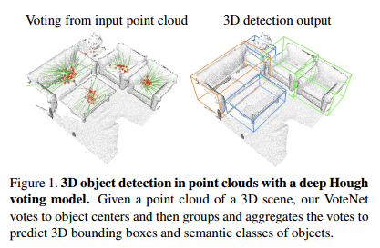
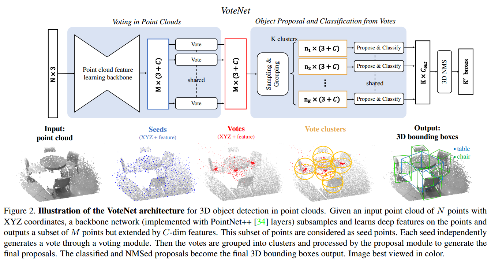
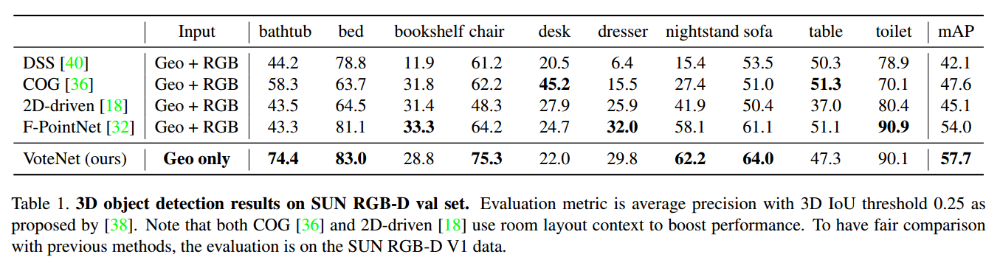
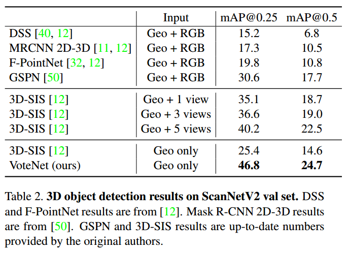
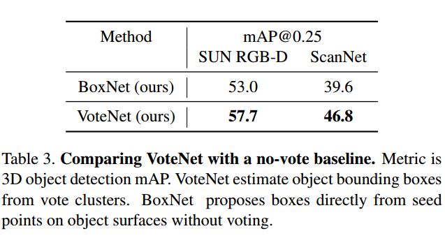
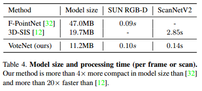
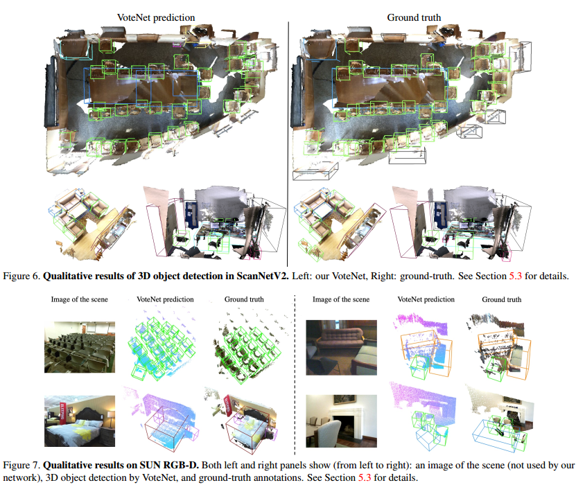

*** 摘要 ***

&emsp;&emsp;目前三维检测器是严重受二维检测器的一个影响，为了利用二维检测器，研究人员常常将三维点云转换成规则的网格（例如鸟眼图或者体素网格），或者依靠二维图像来提出三维框框。很少实验是直接使用点云进行目标测的。为了尽可能给点云数据构成一个3D点云检测流，我们回到了第一原则。由于来自三维空间的二维流体是稀疏的数据，我们面临着从场景的点云中直接预测检测框的一个挑战：一个三维物体的质心可以远离任何一个表面点，因此很难在一个步骤中精确回归。我们提出的VoteNet可以解决这个问题，这是一个融合了霍夫投票的深度点集的端对端的网络。我们的模型通过简单的设计、紧凑的模型尺寸和高效的效率，在两个大型数据集上实现了最先进的3D检测，包括数据集ScanNet和SUN RGB-D。**值得注意的是，VoteNet在不依赖彩色图像的情况下，使用纯几何信息，优于以前的方法。**

## 介绍
&emsp;&emsp;三维目标检测的任务是定位和识别三维场景中的对象。具体来说，我们在这项工作的目标是估计面向三维检测框以及点云中物体的语义分类。与图像相比，点云提供了准确的几何图形和对光照的改变的有更强的鲁棒性(译者补充：点云是通过激光雷达进行获取的，在有雾的环境中会受到很大的影响)。另一方面，点云是不规则的，普通的CNN无法直接对它们进行处理。  

&emsp;&emsp;为了避免处理不规则的点云，目前三维检测的方法在各方面严重依赖于基于二维的检测器。例如，文献[40, 12]将Faster/Mask R-CNN等二维的检测框架扩展三维检测器中。他们将不规则点云体素化为规则的三维网格，这种方法很难利用数据的稀疏性，而且三维卷积计算成本相当昂贵。或者，点云常常转化成二维的鸟瞰图。然后，这种情况下会忽略掉在杂乱的室内环境中至关重要的几何信息。最近，文献[18, 32]提出了一种级联的两步方法，首先检测前视图的物体，第二步将物体定位在由二维盒中挤出的截锥点云中。这种方法也是严重依赖二维检测器，如果二维没有检测到目标，则该目标会被丢失掉。在这项工作中，我们介绍了一个以点云为中心的三维检测框架，无论是在工程结构中还是在对象检测的方法中，它直接处理原始数据，不依赖于任何二维探测器。VoteNet是基于最前沿的三维点云的深度学习模型，以及受启发于在目标检测中霍夫投票的处理方法[21]。  

&emsp;&emsp;我们利用一个分层次学习点云的PointNet++[34]网络，减少了将点云转化为规则结构的需要。通过直接的对点云进行量化处理，不仅能避免信息丢失，而且有利于计算测量到点云数据。  

&emsp;&emsp;PointNet++在分类和语义分割上非常成功，但是很少人将它用于目标检测。为了直接从测量点中获取到三维检测框，一个有效的方法是遵循二维检测器普遍的做法，在密集对象的方案中同样有效[27, 35]。然后，点云固有的稀疏性让这个方法不适用。在多张图像中，一个像素点经常存在于一个目标中心的附近，但在点云中并不存在这种情况。因为一些深度传感器，只能捕捉到物体的表面，三维物体的中心很有可能是空的，与表面的点相离较远。因此，基于点的网络很难在对象中心获取场景上下文的信息。仅仅增加字段并不能解决这个问题，当网络获取到更多上下文的信息后，会导致包含更多附近的物体和混乱。为此，我们建议赋予点云深层网络类似于经典霍夫投票的投票机制。通过投票我们生成了新的点，这些点更加接近于目标中心，重新生成的点可以分组并聚集它们，生成三维盒子边框。  

&emsp;&emsp;与传统的多个分割的难优化的模块的霍夫投票相反，VoteNet是可以优化的。具体来说，先将点云输入到点云骨架网络中，然后进行采样得到一个骨架种子点集合，同时利用它们的特征生成每个点的票数。票数与达到物体中心点的距离是密切相关的。因此，投票集群点出现物体中心点的附近，然后可以通过模块的学习来生成合理的检测框的方式进行聚集。
&emsp;&emsp;我们在两个三维检测框的数据集——SUN RGB-D [38] and ScanNet [5]进行评估。VoteNet在两个数据集中仅使用了几何关系，在RGB图像、几何、多视图中都远远超出了先前的研究结果。  

&emsp;&emsp;我们的研究表明，投票的方法支持更有效的上下文聚合，并且验证了当对象中心远离对象表面时，VoteNet提供了最大的改进。  

&emsp;&emsp;总结，我们的贡献有以下几点：  

&emsp;&emsp;&emsp;&emsp;1.VoteNet通过一个不同的端对端的方法重构了深度学习的上下文的霍夫投票。  
&emsp;&emsp;&emsp;&emsp;2.SUN RGB-D和ScanNet数据集的三维目标检测达到最好的效果  
&emsp;&emsp;&emsp;&emsp;3.在点云中三维目标检测投票重要性中进行深入分析

## 相关工作
#### 三维目标检测
&emsp;&emsp;以前提出过很多关于三维检测框的的方法。例如，找到存在潜在的上下文语义并且能够帮助改善正确的目标的得分的点[25]；基于样本的方法[24, 30, 26]，滑块模型[39]，以及基于滑块模型的深度学习模型[40]；定向梯度云(COG)[36]；最近的3D-SIS[12]等。  

&emsp;&emsp;由于直接在三维环境中工作的复杂性增加，特别是在大型环境中，许多方法都采用某种投影。例如，在MV3D[4]和VoxelNet[51]中，在继续进行管道的其余部分之前，首先将三维数据缩减为鸟瞰图。首先处理二维输入来减少搜索空间，这种方法可以在Frustum PointNets [32]和[18]体现。  

&emsp;&emsp;同样，在[16]中，使用3D地图验证了分割假设。最近，点云上的深层网络被用来探索数据的稀疏性，包括GSPN[50]和PointRCNN[37]，这些工作与我们的工作是相似的。  

#### 目标检测中的霍夫投票
&emsp;&emsp;霍夫变换（Hough Transform）最初引入于20世纪50年代后期，它将检测点样本中简单模式的问题转化为检测参数空间中的峰值。广义霍夫变换[2]进一步将此技术扩展到图像补丁，作为复杂对象存在的指示器。霍夫投票具有深远的影响[22]，其介绍了复杂的形状模型，三维点云的平面抽取[3]，六维的姿态估计[42]等。霍夫投票也与最前沿的技术结合过。在[28]中，投票被分配了表示其重要性的权重，这些权重是使用最大利益框架学习的。在[8, 7]中引进了目标检测的霍夫森林。最近，通过深度特征提取建立一个代码簿，[15]展示了改进了基于6D的姿态估计。同样地，[29]学习了在MRI和超音波图像中构建代码簿的深层功能。在[14]中，经典的hough算法被用于提取汽车标志中的圆形图案，然后将其输入到深度分类网络中。[31]提出了图像中二维实例分割的半解析算子，它与Hough投票有关。
#### 关于点云方面的深度学习
&emsp;&emsp;最近，我们看到了设计适合点云的深度学习架构的兴趣激增[33、34、41、1、23、9、45、43、44、20、17、49、48、46、47]，这在三维对象分类、对象分割和场景分割方面表现出显著的性能。在三维对象检测的上下文中，体素网[51]使用点网模块将体素中的点聚合为体素特征嵌入，而在[32]中，点网用于定位从图像中的二维检测框挤出的平截头体点云中的对象。然而，很少有方法研究如何在原始点云表示中直接提出和检测三维物体。

## 深度霍夫投票网络
&emsp;&emsp;传统的霍夫二维检测器[22]线上和线下的步骤。首先，给定一组带有带注释的对象边界框的图像，用存储在图像面片（或其特征）及其到相应对象中心的偏移之间的映射构造代码簿。在推理中，为了提取周围的面片，可以从图像中找到关键点。这些表面块与代码簿计算的表面块进行比较，重新检索偏移量和中心。目标的表面块常常投票相同，集群将会在目标中心附近形成。最后通过跟踪集群投票，重新计算目标检测框来生成表面块。我们认为这种技术的两类方法都很适合解决这个问题的关键。首先，投票是为稀疏的点集合设置的，因此自然很适合点云。其次，这是基于自底向上的原则，在这个原则上，小部分信息被积累起来，形成一个自信的检测。尽管神经网络可能从一个更大的可接受的范围聚合上下文的点，但是激光雷达扫描到的点只是一部分，如果你不合理的聚合点云，可能会导致神经网络的决策不明确。更严重的是，如果缺少目标质心周围的点，可能会阻止神经网络对点云进行上下文聚合。  

&emsp;&emsp;然而传统的霍夫投票包含多个独立的模块，对其用最先进的点云网络进行集成是一个开放的研究课题。为此，我们建议对不同管道的成分进行调整。  
&emsp;&emsp;&emsp;&emsp;1.关键点被神经网络挑选出来，而不依赖于手工特征  
&emsp;&emsp;&emsp;&emsp;2.神经网络可以投票生成，而不使用代码簿生成  
&emsp;&emsp;&emsp;&emsp;3.为了使用大范围可接受的领域，投票可以减少模糊的决策并使其更有效。另外，一个投票位置可以由更好的聚合的特征向量进行改善。  
&emsp;&emsp;&emsp;&emsp;4.通过点云用可训练的参数来处理层来实现点云聚合。为了利用投票特征，网络可能会过滤掉低质量的投票和生成改进过的候选结果。  

&emsp;&emsp;目标建议的形式为：位置、维度、方向和语义分类可以由聚集的特征、减少追溯点的来源的需要来生成。  
&emsp;&emsp;在下面的内容中，我们将描述如何将上述所有成分组合成一个名为VoteNet的端到端可训练网络。  

## 投票网络工程
&emsp;&emsp;图2说明了我们的端到端检测网络（VoteNet）。整个网络可以分为两部分：一部分处理现有点以生成投票；另一部分操作虚拟点（投票）以提出和分类对象  
### 在点云中学习投票
&emsp;&emsp;从一个输入的大小为Nx3的点云中，用N个点的三维坐标去生成M个投票，每个投票中都包含了三维的坐标和高维的特征向量。主要有两步：通过一个主干网络学习点云特征，然后从种子点中学习霍夫投票。
#### 点云特征学习
&emsp;&emsp;生成一个准确的投票需要几何推理和上下文之间的联系。我们不依赖手工制作的功能，而是利用最近提出的深层网络[34、9、41、23]在点云上进行点功能学习。虽然我们的方法不局限于任何点云网络，我们采用了简单的点云网络作为我们的骨干提取网络，而且它在法向量估计[10]、语义分割[19]以及三维物体位置估计[32]都取得了很好的效果。  
&emsp;&emsp;骨干网络有几个几何抽象层、有跳跃连接的特征传播层（采样层），用XYZ和一个丰富的C维特征向量输入点的子集输入到这些点中，再输出子集合。这个子集合是$(3 + C)$维的M个种子点。每个种子点都会生成一个投票。
#### 用深度网络进行霍夫投票
&emsp;&emsp;与传统的Hough投票（与本地关键点的偏移）由预先计算的代码簿中的查找决定的情况相比，我们使用一个基于深度网络的投票模块生成投票，该模块不仅效率更高（无knn查找），而且更准确，因为它与其他管道一起进行了训练。

&emsp;&emsp;被给出一群种子集合 $\{s_i\}^M_{i=1}$, 其中 $s_{i} = [x_i;\ f_{i}]$, 有 $x_i \in \mathbb{R}^{3}$ 和 $f_i \in \mathbb{R}^C$。从每个独立的种子生成一个共享的模块。投票模块是通过线性连接层、ReLU、批标准化层等多层感知器实现。多层感知器将种子特征 f_i 和输出的欧几里得空间位移 $\Delta{x}_i \in \mathbb{R}^3$ 和一个特征位移 $\Delta{f}_i \in \mathbb{R}^C$，例如像从有 $y_i\ =\ x_i\ +\ \Delta{x_i}$ 和 $g_i\ =\ f_i\ +\ \Delta{f_i}$ 的种子 $s_i$ 生成的投票 $v_i = [y_i;\ g_i]$。 预测的三维偏移量由一个回归损失监督：
$$L_{vote-reg}\ =\ \frac{1}{M_{pos}}\sum_i \|\Delta{x_i}\ -\ \Delta{x_i^*}\| \mathbb{1}[s_i\ on\ object\ ]  $$
其中，$\mathbb{1}[\ s_i\ on\ object\ ]$ 表示种子点 $S_i$ 是否在物体表面和 $M_{pos}$ 是物体表面全部种子的数量。$\Delta{x_i^*}$ 是种子点的位置 $x_i$ 到所属目标质心的真实位移。

&emsp;&emsp;投票数量的展示方式类似于种子在张量中的展示方式，但不属于真实物体的表面。最重要的区别是它们的位置——来自相同目标的种子生成的投票彼此更加接近，这让目标的不同部分的线索更容易联系在一起。接下来我们利用这个语义感知位置去聚合候选目标的投票的特征。

### 从投票中选出候选目标和分类
&emsp;&emsp;投票创建了规范的、由不同目标的多个部分上下文聚合的“会点”。在对投票进行聚类后，为了生成候选目标，我们对它们的特征进行了聚合操作。
#### 通过采样和分组，对投票进行聚类
&emsp;&emsp;聚类的方法有很多，我们采用了较为简单的均值采样策略，然后根据空间约束进行分组。从一个集合投票 $\{v_i\ =\ [y_i;\ g_i]\ \in \mathbb{R}^{3+C}\}_{i=1}^M$ 中，我们基于 $\{y_i\}$ 三维欧几里得空间的最远点采样来K个投票进行采样，目的是为了获取 $k\ =\ 1, \dots,\ K$ 中的 $\{v_{ik}\}$。接着我们得到了 $K$ 类集群。对于每一个 $V_{ik}$ 的三维位置，我们通过找到邻居的投票构成 $K$ 类：$C_k\ =\ \{v_i^{(k)}|\|v_i\ -\ v_{ik}\|\ \leq\ r \}$。虽然很简单，但这个聚类的技术很容易集成到端对端的管道中和在实际中非常有效。
#### 从投票聚类中筛选和分类
&emsp;&emsp;对高维的点进行投票聚类是很有必要的，我们利用一个通用的点集学习网络来聚合投票，以生成候选目标。与传统的Hough投票法确定目标边界的回溯步骤相比，该方法不仅可以从局部观测结果中提出异常边界，还可以预测其他参数，如方向、类别等。

&emsp;&emsp;在我们的实现的工程中，我们对集群的投票聚合和方法使用一个共享的pointnet[33]。被给出的一个投票集群 $C\ =\ \{w_i\}$，其中 $i\ =\ 1, \dots,\ n$ 和它的集群中心 $w_j$，$w_i\ =\ [z_i;\ h_i]$，其中 $z_i\ \in\ \mathbb{R}^3$ 为投票位置， ${h_i\ \in\ \mathbb{R}^3}$ 为投票特征。为了使用几何局部的投票特征，我们通过 $z_i^{'}\ =\ (z_i - z_j)/r$ 将投票位置转化成局部归一化坐标系统特征。通过将这个集合输入到像PointNet模块中，对这个集群 $p(C)$ 的候选目标可以生成出来：
$$p(C)\ =\ MLP_2\{\max_{i=1,\dots,n}\{MLP_1([z_i^{'};\ h_i])\}\}$$
&emsp;&emsp;在每个集群输入到每个管道的最大池化成一个单一的向量之前都单独被$MLP_1$进行处理，来自不同投票的信息会在$MLP_2$进行进一步的融合。我们将候选P表示为一个多维向量，具有一个目标的分数、边界框参数（中心、标题和比例参数化，如[32]所示）和语义分类分数。

#### 损失函数
&emsp;&emsp;候选和分类阶段的损失包含了是否有目标、边界框估计、语义分类损失。我们监督投票的目标分数，这些投票要么靠近地面真实目标中心（0:3米以内），要么远离任何中心（0:6米以上）。我们将投票生成的候选目标分成阳性和阴性，对于其他目标预测的结果不会被惩罚。目标被一个损失交叉熵函数监督，这个函数被批量化的不能被忽略的数据进行归一化。对于阳性的候选目标，我们根据靠近真实值的边界盒对估计的边界盒和预测的分类进行监督。具体来说，我们遵循[32]将盒子的损失与中心回归、航向角估计和盒子尺寸估计分离。对于语义分类，我们使用标准的交叉熵损失。在检测损失的所有回归中，我们使用Huber（平滑-$L_1$[35]）损失。更多细节见附录。

### 实现细节
#### 输入和数据增加
&emsp;&emsp;将来自深度图 $(N\ =\ 20k)$ 或三维扫描$(网格顶点，\ N\ =\ 40k)$随机下采样的$N$个点的点云的数据输入到检测网络中。为了增加训练数据，我们随机下采样的点事来自短暂场景中的点。我们还可以在两个水平方向随机翻转点云，在垂直轴上均匀地旋转场景点$[-5^{\circ},\ 5^{\circ}]$，并随机地均匀地缩放点云$[0.9,\ 1.1]$。
#### 网络工程细节
&emsp;&emsp;主干特征学习网络基于Pointnet++[34]，它有四组抽象($SA$)层和两个特征传播/上采样($FP$)层，其中$SA$层的接收半径分别为0.2、0.4、0.8和1.2米，并将输入分为2048、1024、512和256个点。两个全连接层向上采样第四个集合抽样层的输出，返回到1024个点，具有256个维度和3D坐标（更多详细信息请参见附录）。  
&emsp;&emsp;投票层通过一个多层感知器实现，全连接层输出大小为256, 256,259，其中最后一个全连接层输出xyz偏移量和特征残差。  
&emsp;&emsp;提出的模块由一个集合抽象层，在最大池之后有一个后处理$MLP_2$来生成。集合抽象层使用半径0.3和$MLP_1$，输出大小为128；128；128。最大集合特征由MLP2进一步处理，输出大小为128；128；5+2NH+4NS+NC，其中输出由2个目标分数、3个中心回归值、2NH标题回归数（NH标题栏）和4NS框大小回归数（NS框锚）和NC语义分类数组成。

#### 训练网络
&emsp;&emsp;我们使用一个批处理大小为8、初始学习率为0.001的Adam优化器对整个网络端进行从头到尾的训练。80轮训练后学习率下降10倍，120轮训练后再下降10倍。在一台Volta Quadro GP100 GPU上对模型进行融合训练需要在SUN RGB-D上花费大约10个小时，而在ScanNetV2上花费不到4个小时。  

#### 结果
&emsp;&emsp;我们的投票网络能够处理整个场景的点云并生成合适的结果。结果由IoU阈值为0.25的三维的非极大值抑制模块进行后处理。使用平均准确率，评估与[40]中相同的准则相同。

## 实验
&emsp;&emsp;在本节中，我们首先将我们的霍夫投票型检测器与之前的先进方法在两个大型3D室内物体检测基准（SEC）上进行比较（5.1）。通过分析实验，了解了投票的重要性、不同的投票聚合方法的效果，并说明了该方法在紧凑性和效率上的优越性（5.2）。最后，我们展示了探测器的定性结果（第5.3）。附录中提供了更多的分析和可视化。  

### 与最先进的方法进行比较
#### 数据集
&emsp;&emsp;SUN RGB-D[38]是一个单视图rgb-d数据集，用于三维场景理解。它由大约5千张的RGB-D训练图像组成，这些图像用面向非模态的三维边界框标注，用于37个对象类别。为了向我们的网络提供数据，我们首先使用提供的相机参数将深度图像转换为点云。我们遵循一个标准的评估准则，显示10个最常见类别的表示结果。
&emsp;&emsp;ScanNetv2[5]是一个包含丰富注释的室内场景三维重建网格数据集。它包含从数百个不同房间收集的大约12000训练样本，并用18个对象类别的语义和实例分段进行注释。与SUN RGB-D中的部分扫描相比，ScanNetv2中的场景更完整，平均覆盖的区域更大，对象更多。我们从重建的网格中抽取顶点作为输入点云。由于ScanNetv2不提供非模态或定向边界框标注，因此我们旨在预测轴向标记边界框，如[12]所示。  
#### 方法对比
&emsp;&emsp;我们比较了各种现有技术方法。深滑动形状（DSS）[40]和3D-SIS[12]都是基于3D CNN的探测器，基于Faster R-CNN[35]管道，将几何图形和RGB线索结合在对象建议和分类中。与DSS相比，3D-SIS引入了更复杂的传感器融合方案（将RGB特征反向投影到3D体素），因此能够使用多个RGB视图来提高性能。二维驱动[18]和f-pointnet[32]是基于二维的三维探测器，它们依靠二维图像中的目标检测来减少三维检测搜索空间。渐变云[36]是一个基于滑动窗口的探测器，使用了一个新设计的3D像猪一样的功能。mrcnn 2d-3d是一个简单的基线，它直接将mask rcnn[11]实例分割结果投影到3d中，以获得边界框估计。GSPN[50]是一种最新的实例分割方法，它使用一个生成模型来生成目标实例，这也是基于Pointnet++为主干的。  

#### 结果
&emsp;&emsp;结果汇总在表1和表2中。在SUN RGB-D和ScanNet中，VoteNet比所有之前的方法至少增加了3.7和6.5个mAP。值得注意的是，当我们只使用几何输入（点云）而它们同时使用几何和RGB图像时，我们就实现了这些改进。表1显示，在训练样本最多的“椅子”类别中，我们的方法比以前的技术水平提高了11个AP以上。表2表明，当仅采用几何输入时，我们的方法比基于3dcn的3d-sis方法有显著优势，超过20个AP。附录中提供了扫描仪的每类评估。重要的是，两个数据集中都使用了相同的网络超参数集。
### 实验分析
#### 投票或不投票？
&emsp;&emsp;我们的VoteNet的一个直接基线是一个网络，它直接从采样的场景点生成候选检测边框盒，无需投票。这种基线——我们称之为 BoxNet ——对于提取投票带来的改进至关重要。BoxNet与VoteNet具有相同的主干，但它不是投票，而是直接从种子点生成框（更多细节见附录）。表3显示，在SUN RGB-D上，投票将显著提高大约5个mAP，而在ScanNet上，投票将显著提高了7个mAP以上。  

&emsp;&emsp;那么，投票有什么帮助呢？我们认为，由于在稀疏的三维点云中，现有的场景点往往远离对象的质心，直接建议可能具有较低的置信度和不准确的非模态框。相反，投票使这些较低的置信点更紧密地结合在一起，并允许通过聚集来加强他们的假设。我们在图3中的一个典型的ScanNetv2场景中演示了这种现象。我们只使用那些种子点覆盖场景，如果采样，这些种子点将生成精确的候选结果。如图所示，与Boxnet（左）相比，VoteNet（右）提供了更广泛的“良好”种子点覆盖范围，展示了投票带来的鲁棒性。我们继续进行图4中的第二个分析，显示在同一个图上（以不同的比例），对于每个SUN RGB-D类别：（在蓝点中）在VoteNet和BoxNet之间的地图中获得，以及（在红色方块中）在目标点（在其表面上）和其非模态框中心之间的最近距离，按类别平均并按平均类大小归一化（大距离表示对象中心通常远离其表面）。按前一种分类，我们看到了很强的相关性。也就是说，当目标点倾向于远离非模态盒中心时，投票会起到更大的作用。
#### 投票聚集效益
&emsp;&emsp;投票聚合是投票的一个重要组成部分，因为它允许选票之间有联系。因此，分析不同的聚合方案对性能的影响是非常有用的。  
&emsp;&emsp;在图5（右图）中，我们表明，由于存在杂乱投票（即来自非对象种子的投票），使用学习的Pointnet和Max池进行投票聚合比手动聚合本地区域中的投票获得更好的结果。我们测试了这些聚合的3种类型（前三行）：max、average和RBG加权（基于到集群中心的投票距离）。与使用Pointnet进行聚合（等式2）不同，投票功能直接进行聚合，例如，对于平均池：MK）。  
&emsp;&emsp;在图5（左）中，我们展示了投票聚合半径如何影响检测（使用max pooling使用指针测试）。随着聚集半径的增加，VoteNet的效果会提高，直到其在0.2半径处达到峰值。处理更大的区域，虽然引入了更多的杂乱投票，从而破坏好的投票，导致性能下降。  
  

&emsp;&emsp;提出的模型是非常有效的，因为它利用了点云的稀疏性，避免了在空域中搜索。与以前的最佳方法（表4）相比，我们的模型在尺寸上比FPointNet（SUN RGB-D上的现有技术）小4倍以上，在速度上比3D-SIS（ScanNetv2上的现有技术）快20倍以上。请注意，3D-SIS的ScanNetv2处理时间在脱机批处理模式下计算为平均时间，而我们的时间是通过顺序处理进行测量的，可以在在线应用程序中实现。
  
#### 定性结果和讨论
&emsp;&emsp;图6和图7分别显示了扫描器和SUN RGB-D场景上的VoteNet检测结果的几个代表性示例。如图所示，场景非常多样，并带来了多种挑战，包括杂乱、偏袒、扫描伪影等。尽管存在这些挑战，我们的网络仍然显示出相当强大的结果。例如，如图6所示，在顶部场景中如何正确检测绝大多数椅子。我们的方法能够很好地区分附加的沙发椅和左下角的场景；并预测右下角场景中零碎杂乱的桌子的完整边界框。  
&emsp;&emsp;不过，我们的方法仍然有局限性。常见的故障案例包括非常薄的物体上的遗漏，如门、窗和顶部场景中黑色边界框中表示的图片（图6）。由于我们没有利用RGB信息，检测这些类别几乎是不可能的。图7还显示了我们的方法在单视图深度图像的部分扫描中的优势。例如，它在左上角的场景中检测到的椅子比地面真相提供的更多。在右上角的场景中，我们可以看到，尽管只看到沙发的一部分，VoteNet却能很好地感觉到非模态边界框。右下角的场景显示了一个不太成功的非模态预测，其中对一个非常大的桌子只观察到了一小部分。  
&emsp;&emsp;在这项工作中，我们介绍了VoteNet：一个简单但功能强大的3D物体检测模型，受启发于霍夫投票。网络学习直接从点云投票给候选目标，并学习通过其特征和局部几何聚集投票来生成高质量的候选目标。比以前的方法，利用深度和彩色图像，仅使用三维点云，模型显示出明显改善的效果。  
&emsp;&emsp;在未来的工作中，我们打算探索如何将RGB图像纳入我们的检测框架中，并在下游应用中利用我们的检测器，如3D实例分割。我们相信，霍夫投票和深度学习的协同作用可以推广到更多的应用中，如6D姿态估计、基于模板的检测等，并期望在这方面有更多的研究。

## 感谢
&emsp;&emsp;这项工作部分得到了国家科学基金会（NSF）资助的IIS-1763268和一项文涅瓦布什学院奖学金的支持。
我们感谢丹尼尔·胡伯，贾斯汀·约翰逊，乔治亚州Gkioxari和Jitendra Malik提供有价值的讨论和反馈。